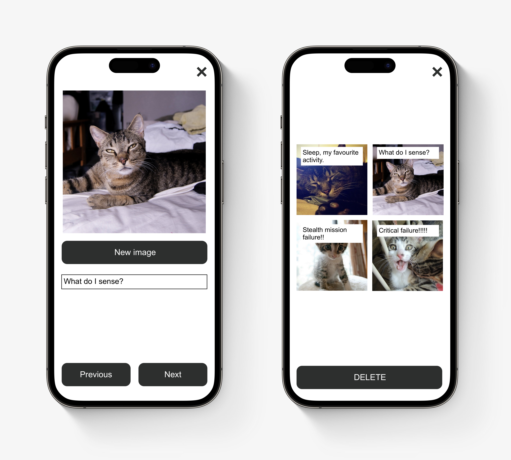

# React Native assignment

Create a simple React Native app according to the specifications given below. Aim to spend no more than 3-4 hours on this assignment, **even if that means the result is incomplete or non-functional**. The intent is to review your efforts together, discussing your process, solution direction, architectural choices and code implementation.

Git version management should be used for keeping a commit history with the project, which can be submitted via GitHub repo or emailed in a zip folder.

## Comicat App

The Comicat App is an app that allows users to create four-panel cat themed comics in minutes on their mobile phone or tablet device. Users can create new comics panel by panel, choosing a random cat picture and adding a fitting caption. They can scroll through a list of previously created comics, view each of them full size and delete those that they no longer wish to store.

### Requirements

- Comics are stored in memory during a session, but do not need to persist after the app is closed. (no backend or local storage required). 
- Since there are no designs other than the added wireframes, we will not focus on appearance. 
- The app should work on iOS and Android devices.

- The app has a landing screen that includes:
	- A scrolling list of saved comics from temporary storage. Pressing an item opens the show screen for that specific item.
	- A button that opens the comic creation flow. 

- The app has a comic show screen that includes:
	- A 2x2 grid of comic panels, each showing an image with an overlay that shows the text that was chosen with the image.
	- A button to return to the landing screen.
	- A button to delete this comic from temporary storage, removing it from the list on the landing screen.

- The app has a comic creation flow that includes:
	- Multiple tabs/screens that the user can click through.
	- Four tabs containing a panel creation screen.
	- One tab containing the comic show screen with the panels that were created in the previous tabs, minus the delete button.
	- A button to return to the landing screen and cancel the creation process (half made comics are not added to the list).
	- Navigation buttons to return to the previous tab (if not on the first) or go to the next tab (if not on the last).
	- A save button on the last tab, which will add the comic to the index list and return to the landing screen.

- The app has a panel creation screen that includes:
	- A random cat image, taken from https://thecatapi.com
	- A button to fetch a different cat image.
	- A text input to add a caption for the image.

### Wireframes

